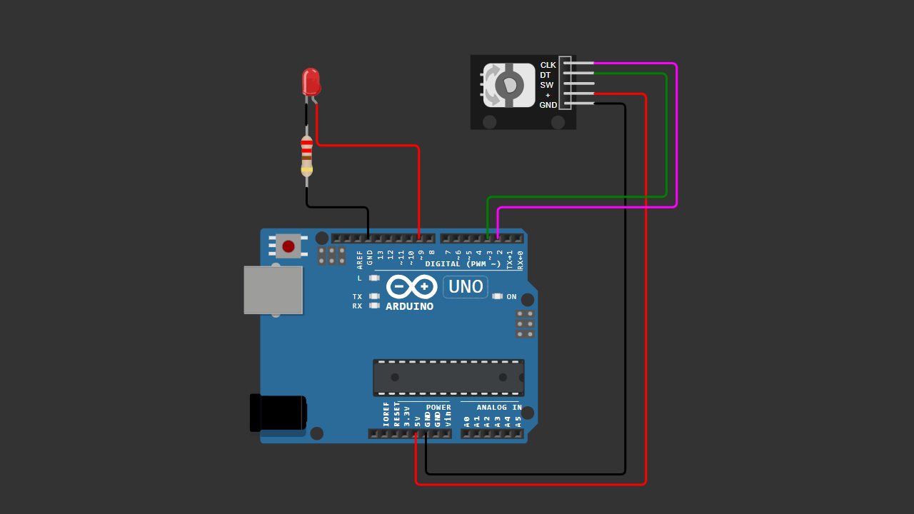

# Arduino Rotary Encoder + LED PWM Control

Control LED brightness using a rotary encoder with Arduino.

Rotate clockwise to increase brightness.  
Rotate counterclockwise to decrease brightness.

This project demonstrates how to combine rotary encoder input with PWM LED output.

---

## Components

- Arduino Uno
- Rotary Encoder (CLK, DT, SW)
- LED
- Resistor 220Ω
- Breadboard
- Jumper wires

---

## Wiring

### Rotary Encoder
- CLK  → Pin 2
- DT   → Pin 3
- +    → 5V
- GND  → GND

### LED
- Anode (+) → Pin 9
- Cathode (-) → Resistor 220Ω → GND

---

## 📷 Wiring Diagram

> Make sure your wiring matches the diagram above before uploading the code.

---

## 💻 Arduino Code

You can download the Arduino sketch here:

[Download Arduino Code](Arduino_Rotary_LED_PWM.ino)

Or open the `.ino` file directly inside this repository.

---

## How It Works

The rotary encoder detects direction of rotation.

- Clockwise → Increase brightness
- Counterclockwise → Decrease brightness

Brightness value is limited between 0–255 and sent to LED using PWM (`analogWrite`).

---

## PWM Range

0   = LED OFF  
255 = Full brightness  

---

## 🎥 Video Tutorial

Watch the full step-by-step tutorial on YouTube:

👉 

---

## License

Free to use for educational purposes.

---

Happy Coding 🚀
